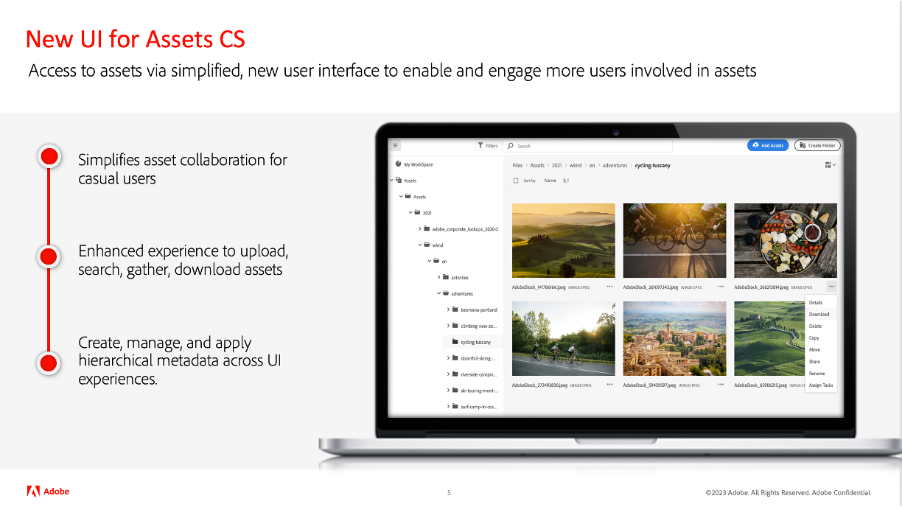
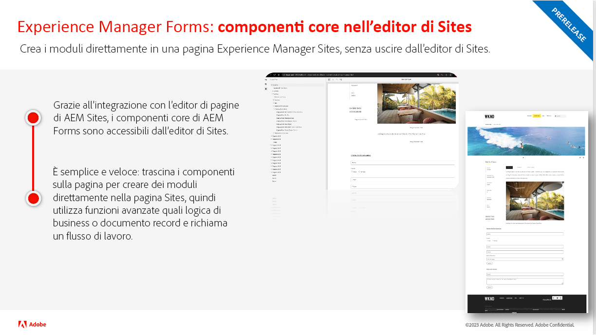
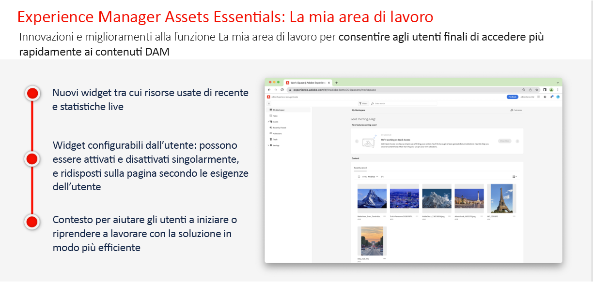
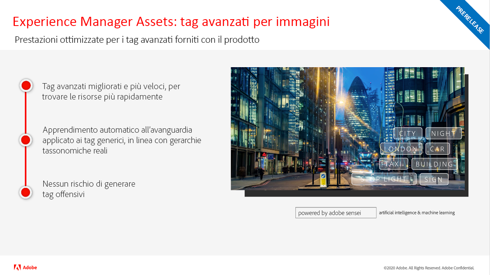
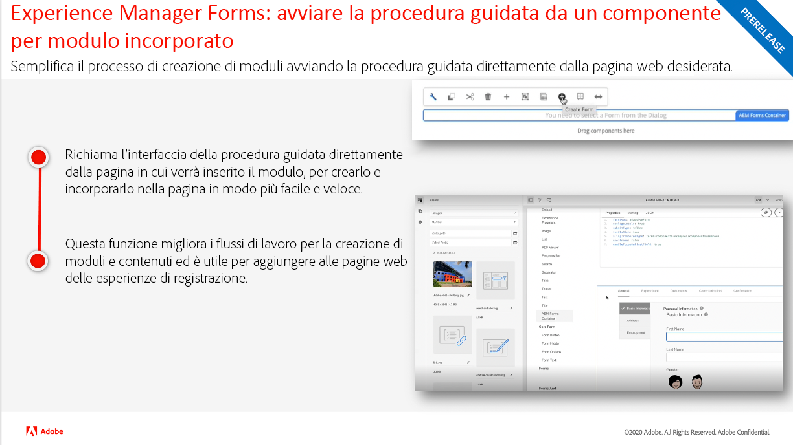
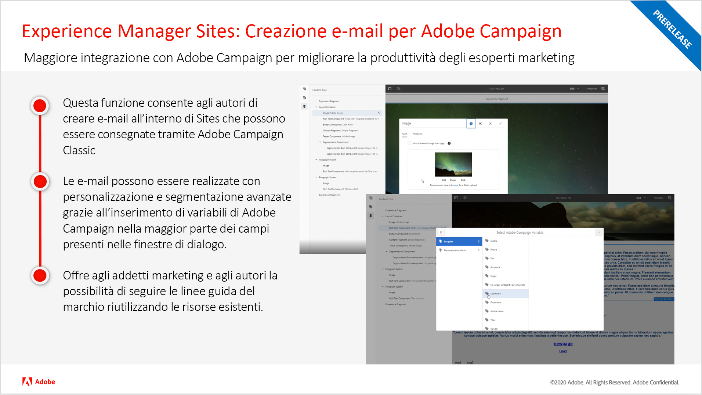
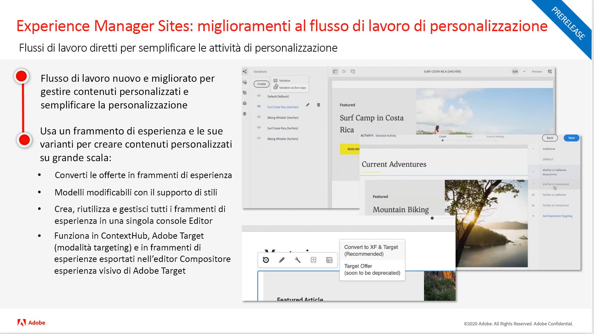

<!---
# Adobe Experience Manager as a Cloud Service release updates

Get a quick overview of the latest features on Adobe Experience Manager as a Cloud Service. These are short, roughly 10 minutes videos delivered by the AEM product team that share highlights of the latest release.

## Latest Update

<table style="max-width: 50%;">
  <tr>
    <td>
      
      

        <a href="./2023/2023-4-0.md">
          <strong>Release | 2023.4.0</strong>
           
        </a>
          <em>Release date May 2023 </em>
      

      

        <a href="https://experienceleague.adobe.com/docs/experience-manager-cloud-service/content/release-notes/release-notes/release-notes-current.html">Release notes</a>
      

    </td>
  </tr>  
</table> 

## Past Updates

<table style="max-width: 50%;">
  <tr>
    <td>
      
      

        <a href="./2023/2023-2-0.md">
          <strong>Release | 2023.2.0</strong>
           
        </a>
          <em>Release date Mar 2023 </em>
      

      

        <a href="https://experienceleague.adobe.com/docs/experience-manager-cloud-service/content/release-notes/release-notes/release-notes-current.html">Release notes</a>
      

    </td>
    <td>
      
      

        <a href="./2023/2023-1-0.md">
          <strong>Release | 2023.1.0</strong>
           
        </a>
          <em>Release date  Feb 2023 </em>
      

      

        <a href="https://experienceleague.adobe.com/docs/experience-manager-cloud-service/content/release-notes/release-notes/release-notes-current.html">Release notes</a>
      

    </td>
    <td>
      
      

        <a href="./2022/2022-10-0.md">
          <strong>Release | 2022.10.0</strong>
           
        </a>
          <em>Release date  Oct 13, 2022 </em>
      

      

        <a href="https://experienceleague.adobe.com/docs/experience-manager-cloud-service/content/release-notes/release-notes/release-notes-current.html">Release notes</a>
      

    </td>
  <tr>  
    <td>
      
      

        <a href="./2022/2022-8-0.md">
          <strong>Release | 2022.8.0</strong>
           
        </a>
          <em>Release date  Sept 1, 2022 </em>
      

      

        <a href="https://experienceleague.adobe.com/docs/experience-manager-cloud-service/content/release-notes/release-notes/release-notes-current.html">Release notes</a>
      

    </td>
    <td>
      
      

        <a href="./2022/2022-7-0.md">
          <strong>Release | 2022.7.0</strong>
           
        </a>
          <em>Release date  Aug 8, 2022 </em>
      

      

        <a href="https://experienceleague.adobe.com/docs/experience-manager-cloud-service/content/release-notes/release-notes/release-notes-current.html">Release notes</a>
      

    </td>
    <td>
      
      

        <a href="./2022/2022-6-0.md">
          <strong>Release | 2022.6.0</strong>
           
        </a>
          <em>Release date  June 30, 2022 </em>
      

      

        <a href="https://experienceleague.adobe.com/docs/experience-manager-cloud-service/content/release-notes/release-notes/release-notes-current.html">Release notes</a>
      

    </td>
  </tr>
  <tr>
    <td>
      
      

        <a href="./2022/2022-5-0.md">
          <strong>Release | 2022.5.0</strong>
           
        </a>
          <em>Release date  June 9, 2022 </em>
      

      

        <a href="https://experienceleague.adobe.com/docs/experience-manager-cloud-service/content/release-notes/release-notes/release-notes-current.html">Release notes</a>
      

    </td>
    <td>
      
      

        <a href="./2022/2022-4-0.md">
          <strong>Release | 2022.4.0</strong>
           
        </a>
          <em>Released  May 5, 2022 </em>
      

      

        <a href="https://experienceleague.adobe.com/docs/experience-manager-cloud-service/content/release-notes/release-notes/release-notes-current.html">Release notes</a>
      

    </td>
    <td>
      
      

        <a href="./2022/2022-3-0.md">
          <strong>Release | 2022.3.0</strong>
           
        </a>
          <em>Released  March 31, 2022 </em>
      

      

        <a href="https://experienceleague.adobe.com/docs/experience-manager-cloud-service/content/release-notes/release-notes/release-notes-current.html">Release notes</a>
      

    </td>
  </tr>
</table>
--->

# Aggiornamenti della versione di Adobe Experience Manager as a Cloud Service

Veloce panoramica delle funzioni più recenti di Adobe Experience Manager as a Cloud Service. Si tratta di brevi video di circa 10 minuti forniti dal team di prodotto AEM, per presentare gli aspetti salienti dell’ultima versione.

## Ultimo aggiornamento

<table style="max-width: 50%;">
  <tr>
    <td>
      
      

        <a href="./2023/2023-2-0.md">
          <strong>Versione | 2023.2.0</strong>
           
          </a>
          <em>Data di rilascio: marzo 2023</em>
      

      

        <a href="https://experienceleague.adobe.com/docs/experience-manager-cloud-service/content/release-notes/release-notes/release-notes-current.html?lang=it">Note sulla versione</a>
      

    </td>
  </tr>  
</table>

## Aggiornamenti precedenti

<table style="max-width: 50%;">
  <tr>
    <td>
      
      

        <a href="./2023/2023-1-0.md">
          <strong>Versione | 2023.1.0</strong>
           
        </a>
          <em>Data di rilascio: febbraio 2023</em>
      

      

        <a href="https://experienceleague.adobe.com/docs/experience-manager-cloud-service/content/release-notes/release-notes/release-notes-current.html?lang=it">Note sulla versione</a>
      

    </td>
    <td>
      
      

        <a href="./2022/2022-10-0.md">
          <strong>Versione | 2022.10.0</strong>
           
        </a>
          <em>Data di rilascio 13 ottobre 2022</em>
      

      

        <a href="https://experienceleague.adobe.com/docs/experience-manager-cloud-service/content/release-notes/release-notes/release-notes-current.html?lang=it">Note sulla versione</a>
      

    </td>  
    <td>
      
      

        <a href="./2022/2022-8-0.md">
          <strong>Versione | 2022.8.0</strong>
           
        </a>
          <em>Data di rilascio: 1 settembre 2022</em>
      

      

        <a href="https://experienceleague.adobe.com/docs/experience-manager-cloud-service/content/release-notes/release-notes/release-notes-current.html?lang=it">Note sulla versione</a>
      

    </td>
  </tr>
  <tr> 
    <td>
      
      

        <a href="./2022/2022-7-0.md">
          <strong>Versione | 2022.7.0</strong>
           
        </a>
          <em>Data di rilascio: 8 agosto 2022 </em>
      

      

        <a href="https://experienceleague.adobe.com/docs/experience-manager-cloud-service/content/release-notes/release-notes/release-notes-current.html?lang=it">Note sulla versione</a>
      

    </td>
    <td>
      
      

        <a href="./2022/2022-6-0.md">
          <strong>Versione | 2022.6.0</strong>
         
      </a>
        <em>Data di rilascio: 30 giugno 2022 </em>
      

      

        <a href="https://experienceleague.adobe.com/docs/experience-manager-cloud-service/content/release-notes/release-notes/release-notes-current.html?lang=it">Note sulla versione</a>
      

    </td>
    <td>
      
      

        <a href="./2022/2022-5-0.md">
          <strong>Versione | 2022.5.0</strong>
         
      </a>
        <em>Data di rilascio: 9 giugno 2022 </em>
      

      

        <a href="https://experienceleague.adobe.com/docs/experience-manager-cloud-service/content/release-notes/release-notes/release-notes-current.html?lang=it">Note sulla versione</a>
      

    </td>
  </tr>
  <tr>     
    <td>
      
      

        <a href="./2022/2022-4-0.md">
          <strong>Versione | 2022.4.0</strong>
         
      </a>
        <em>Data di rilascio: 5 maggio 2022 </em>
      

      

        <a href="https://experienceleague.adobe.com/docs/experience-manager-cloud-service/content/release-notes/release-notes/release-notes-current.html?lang=it">Note sulla versione</a>
      

    </td>
    <td>
      
      

        <a href="./2022/2022-3-0.md">
          <strong>Versione | 2022.3.0</strong>
         
      </a>
        <em>Data di rilascio: 31 marzo 2022 </em>
      

      

        <a href="https://experienceleague.adobe.com/docs/experience-manager-cloud-service/content/release-notes/release-notes/release-notes-current.html?lang=it">Note sulla versione</a>
      

    </td>
    <td>
      
      

        <a href="./2022/2022-1-0.md">
          <strong>Versione | 2022.1.0</strong>
         
      </a>
        <em>Data di rilascio: 3 febbraio 2022 </em>
      

      

        <a href="https://experienceleague.adobe.com/docs/experience-manager-cloud-service/content/release-notes/release-notes/2022/release-notes-2022-1-0.html?lang=it">Note sulla versione</a>
      

    </td>
  </tr>
</table>