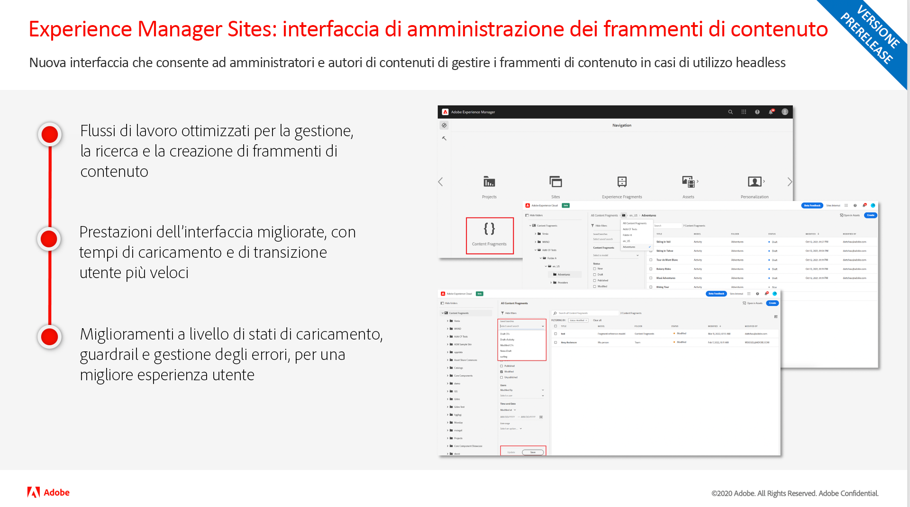
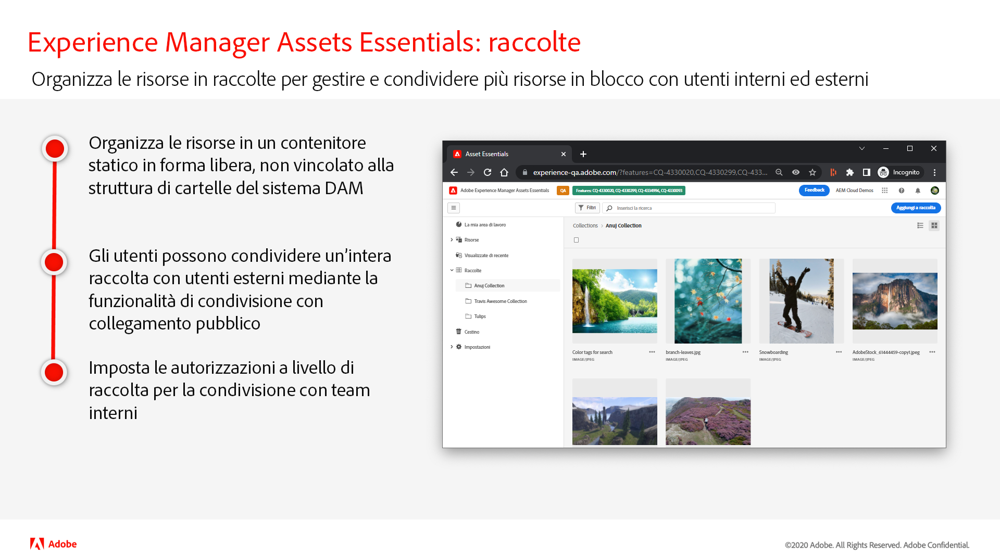
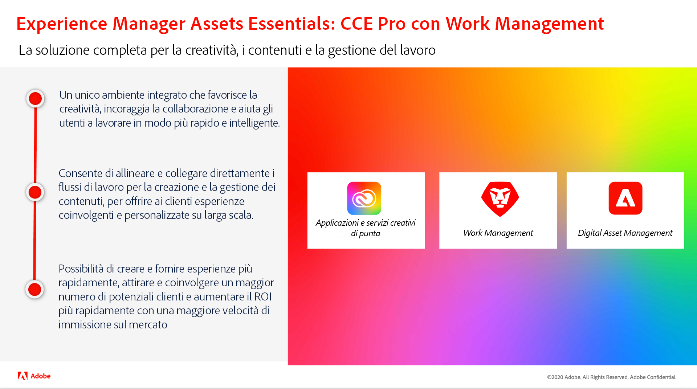
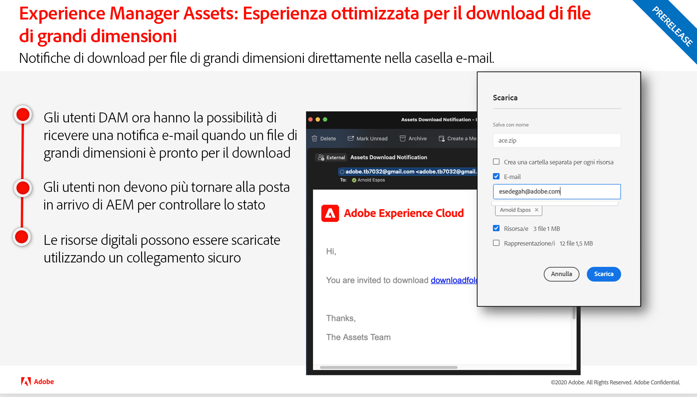
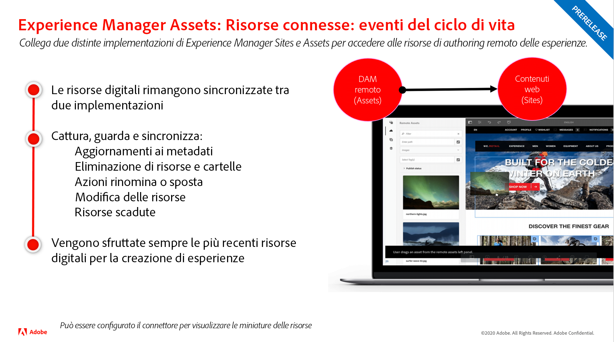

# Aggiornamenti della versione di Adobe Experience Manager as a Cloud Service

Veloce panoramica delle funzioni più recenti di Adobe Experience Manager as a Cloud Service. Si tratta di brevi video di circa 10 minuti forniti dal team di prodotto AEM, per presentare gli aspetti salienti dell’ultima versione.

## Ultimo aggiornamento

<table style="max-width: 50%;">
<tr>
  <td>
    
    

      <a href="./2022/2022-5-0.md">
        <strong>Versione | 2022.5.0</strong>
         
      </a>
        <em>Data di rilascio: 9 giugno 2022 </em>
    

    

      <a href="https://experienceleague.adobe.com/docs/experience-manager-cloud-service/content/release-notes/release-notes/release-notes-current.html?lang=it">Note sulla versione</a>
    

  </td>
</tr>  
</table>

## Aggiornamenti precedenti

<table style="max-width: 50%;">
<tr>
  <td>
    
    

      <a href="./2022/2022-4-0.md">
        <strong>Versione | 2022.4.0</strong>
         
      </a>
        <em>Data di rilascio: 5 maggio 2022 </em>
    

    

      <a href="https://experienceleague.adobe.com/docs/experience-manager-cloud-service/content/release-notes/release-notes/release-notes-current.html">Note sulla versione</a>
    

  </td>
  <td>
    
    

      <a href="./2022/2022-3-0.md">
        <strong>Versione | 2022.3.0</strong>
         
      </a>
        <em>Data di rilascio: 31 marzo 2022 </em>
    

    

      <a href="https://experienceleague.adobe.com/docs/experience-manager-cloud-service/content/release-notes/release-notes/release-notes-current.html">Note sulla versione</a>
    

  </td>
  <td>
    
    

      <a href="./2022/2022-1-0.md">
        <strong>Versione | 2022.1.0</strong>
         
      </a>
        <em>Data di rilascio: 3 febbraio 2022 </em>
    

    

      <a href="https://experienceleague.adobe.com/docs/experience-manager-cloud-service/content/release-notes/release-notes/2022/release-notes-2022-1-0.html?lang=it">Note sulla versione</a>
    

  </td>
  </tr>
  <tr>
  <td>
    
    

    <a href="./2021/2021-11-0.md">
        <strong>Versione | 2021.11.0</strong>
         
      </a>
    <em>Data di rilascio: 16 dicembre 2021</em>
    

    

      <a href="https://experienceleague.adobe.com/docs/experience-manager-cloud-service/content/release-notes/release-notes/2021/release-notes-2021-11-0.html?lang=it">Note sulla versione</a>
    

  </td>
</tr>
</table>
